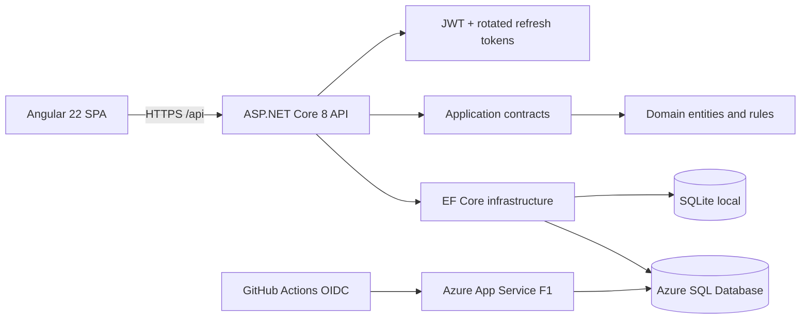

# CloudTrack

CloudTrack is a production-minded project workspace built as a full-stack and Azure portfolio project. It covers the complete identity lifecycle, role-based administration, project and task workflows, automated verification, App Service delivery, and infrastructure as code.

> Deployment status: the application is live on Azure App Service Free F1 with Azure SQL Free/Serverless. Local and cross-device E2E tests are also verified.

[Open the live CloudTrack demo](https://app-cloudtrack-dev-xe3xxsh.azurewebsites.net)


## What it demonstrates

- Login, registration, logout, forgot password, reset password, and authenticated profile flows.
- Short-lived JWT access tokens with hashed, rotated refresh tokens in an HttpOnly cookie.
- `Admin`, `Manager`, and `Member` roles with protected user and role management.
- Project and task management with audit history, search, filters, paging, and optimistic concurrency.
- Responsive Angular Material UI verified against desktop Chromium and a Pixel 7 viewport.
- Layered ASP.NET Core backend with SQLite for lightweight local tests and SQL Server in Azure.
- App Service ZIP delivery without Docker, GitHub Actions OIDC, secret scanning, health probes, and Bicep infrastructure.

## Architecture



The App Service package serves the Angular bundle and API from one origin. This keeps browser configuration public and simple while the backend receives database credentials and signing keys only through protected App Service settings.

## Technology

| Area | Choice |
| --- | --- |
| Web | Angular 22, standalone components, Angular Material, signals |
| API | ASP.NET Core 8, controllers, Problem Details, rate limiting |
| Data | EF Core 8, SQLite, SQL Server |
| Security | JWT bearer auth, password hashing, refresh-token rotation, RBAC |
| Quality | xUnit, ASP.NET integration tests, Vitest, Playwright |
| Delivery | App Service ZIP, GitHub Actions OIDC, Gitleaks, Azure Bicep; optional Docker |
| Azure | Linux App Service Free F1, Azure SQL Database Free/Serverless |

## Run locally

Prerequisites: .NET SDK 8, Node.js 24, and npm. Docker is optional.

### 1. Configure the API safely

Do not put a real key or password in `appsettings.json`. Store the local signing key outside Git with .NET user-secrets:

```powershell
cd backend/src/CloudTrack.Api
dotnet user-secrets set "Jwt:SigningKey" "replace-with-at-least-32-random-characters"
dotnet run --urls http://localhost:5080
```

Swagger is available at `http://localhost:5080/swagger` in Development and health at `http://localhost:5080/health`.

### 2. Run the Angular app

```powershell
cd frontend
npm ci
npm start
```

Open `http://localhost:4200`. Registration is enabled, so no shared demo password is required.

### Docker Compose

Copy `.env.example` to `.env`, replace every placeholder locally, then run:

```powershell
docker compose up --build
```

The combined app is exposed at `http://localhost:8080`. `.env` is ignored and must never be committed.

## Verification

```powershell
dotnet test backend/CloudTrack.sln --configuration Release
cd frontend
npm test -- --watch=false
npm run build
npm run e2e
npm audit --omit=dev
```

CI repeats these checks and scans the full Git history for secrets. Azure delivery builds a ZIP package and is gated by the repository variable `AZURE_DEPLOY_ENABLED=true` plus an approved GitHub Environment.

## Security and configuration

- `appsettings.json` contains non-secret defaults and an empty signing key.
- Local secrets belong in .NET user-secrets or an ignored `.env` file.
- Azure secrets are protected App Service settings; they are never compiled into Angular or stored in GitHub.
- Forgot-password responses do not reveal whether an email exists.
- Changing a password revokes all refresh tokens.
- The auth endpoints are rate-limited; API errors use consistent Problem Details.
- CI runs Gitleaks before delivery.

See [configuration guidance](docs/configuration.md) before committing or deploying.

## Repository map

```text
backend/
  src/CloudTrack.Domain/          Entities and domain state
  src/CloudTrack.Application/     Contracts and use-case abstractions
  src/CloudTrack.Infrastructure/  EF Core, authentication, services
  src/CloudTrack.Api/             HTTP boundary and composition root
  tests/                          Unit and integration tests
frontend/                         Angular application and Playwright tests
infra/main.bicep                  Lowest-cost learning environment template
.github/workflows/                CI and gated Azure delivery
docs/                             Architecture, operations, and interview notes
```

## Documentation

- [Configuration and secret safety](docs/configuration.md)
- [Architecture decisions](docs/architecture-decisions.md)
- [Azure deployment runbook](docs/azure-deployment.md)
- [API surface](docs/api.md)
- [Interview notes](docs/interview-notes.md)
- [Docker workflow](docs/docker.md)

## Planned hardening

- Replace the development reset-token display with a transactional email provider.
- Move secrets to Key Vault if the operational trade-off is justified.
- Add private networking for Azure SQL and restore testing for backups.
- Add OpenTelemetry traces, explicit SLOs, and performance baselines.

The Git history is intentionally split into small conventional commits so reviewers can follow the project from foundation to delivery.
