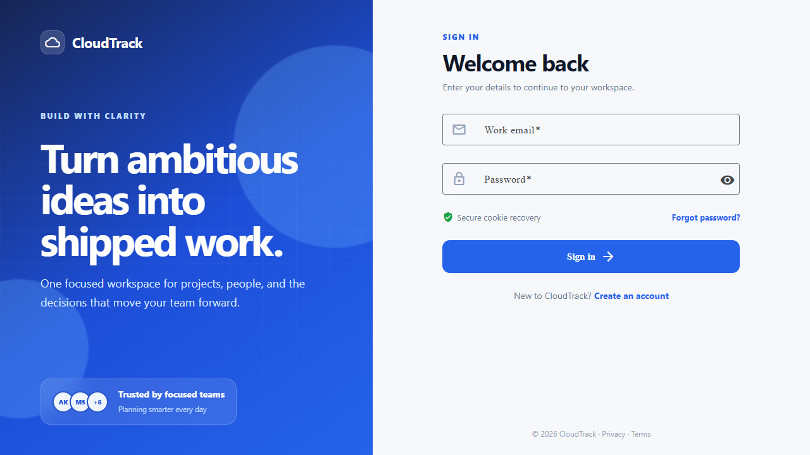
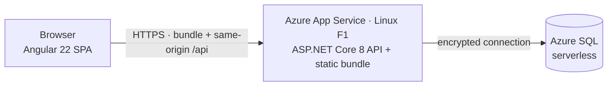
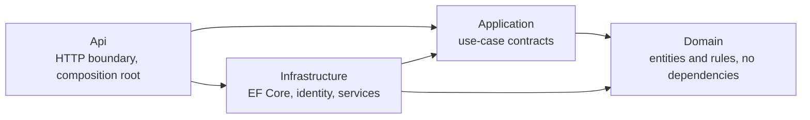
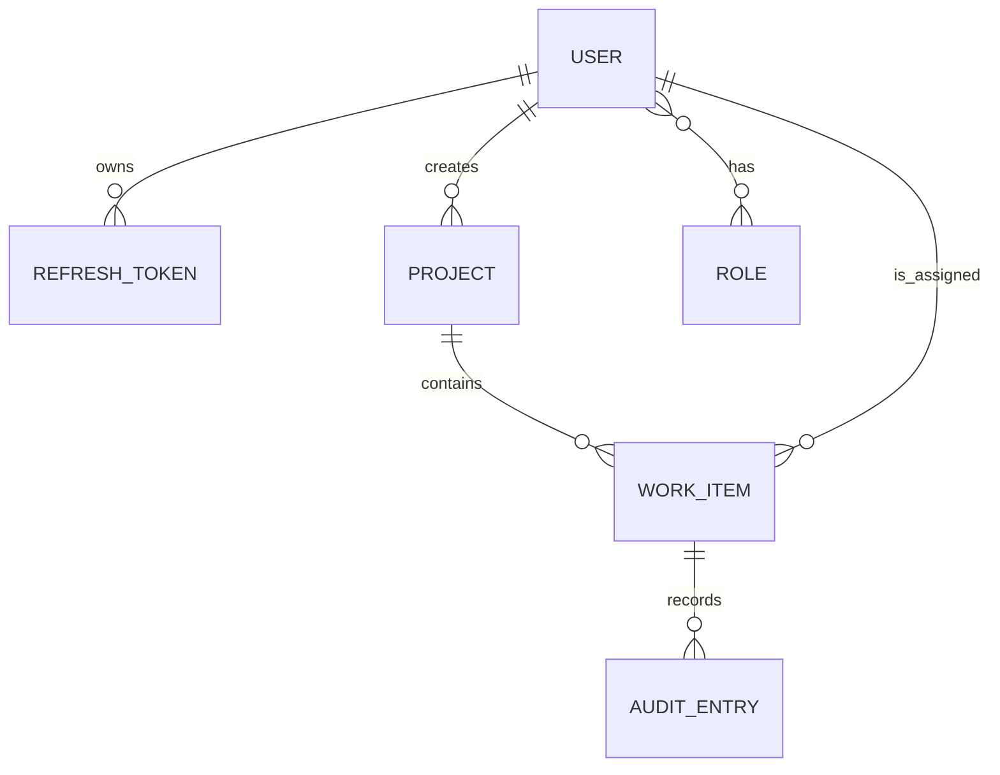
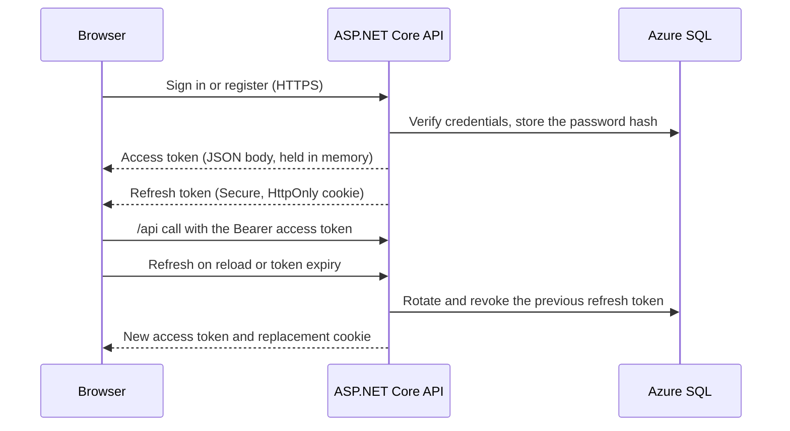
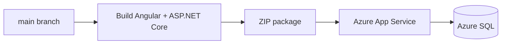

# CloudTrack

CloudTrack is a personal full-stack and Azure portfolio project built to keep ideas, tasks, and progress organized in one place. It demonstrates the complete identity lifecycle, role-based administration, project and task workflows, automated verification, App Service delivery, and infrastructure as code.

> Deployment status: the application is live on Azure App Service Free F1 with Azure SQL Free/Serverless. Local and cross-device E2E tests are also verified.

[Open the live CloudTrack demo](https://app-cloudtrack-dev-xe3xxsh.azurewebsites.net)

Live authentication routes:

- [Login](https://app-cloudtrack-dev-xe3xxsh.azurewebsites.net/auth/login)
- [Register](https://app-cloudtrack-dev-xe3xxsh.azurewebsites.net/auth/register)
- [Forgot password](https://app-cloudtrack-dev-xe3xxsh.azurewebsites.net/auth/forgot-password)
- [Swagger API documentation](https://app-cloudtrack-dev-xe3xxsh.azurewebsites.net/api-docs)

> Password recovery currently runs in clearly labelled portfolio demo mode. The API creates a 30-minute, single-use reset token and the UI exposes only a continue link because no email account or API key is stored in the demo. Responses include a non-persisted decoy token for unknown addresses so the response shape does not reveal whether an account exists. Replace this fallback with transactional email before using CloudTrack for real user data.

Angular is compiled into the ASP.NET Core `wwwroot` folder and served by the same Linux App Service as the API. No Static Web App or separate runtime is required for the Azure deployment.



## What it demonstrates

- Login, registration, logout, forgot password, reset password, and authenticated profile flows.
- Short-lived JWT access tokens with hashed, rotated refresh tokens in an HttpOnly cookie.
- `Admin`, `Manager`, and `Member` roles with protected user and role management.
- Project and task management with audit history, search, filters, paging, and optimistic concurrency.
- Purpose-named SQL schemas (`mas`, `tra`, `sec`, `aud`) and audit columns (`CreatedBy`/`CreatedAt`/`UpdatedBy`/`UpdatedAt`/`IsActive`) on every table.
- Responsive Angular Material UI verified against desktop Chromium and a Pixel 7 viewport.
- Layered ASP.NET Core backend running SQL Server everywhere: LocalDB for development and tests, Azure SQL in production.
- App Service ZIP delivery, GitHub Actions OIDC (when enabled), secret scanning, health probes, Bicep infrastructure, and opt-in Azure Monitor OpenTelemetry.

## Architecture

One Azure App Service hosts the ASP.NET Core API and serves the compiled Angular bundle from the same origin. A single origin removes the need for a separate Static Web App, another runtime, and production CORS.



The backend is layered so business rules stay free of framework and data-access concerns:



Azure SQL is the production database. Development uses SQL Server LocalDB, while integration and browser tests can target an isolated SQL Server database through environment variables. The App Service and database are provisioned by [Bicep](infra/main.bicep) and the app is delivered as a ZIP package.

### Data model



### Authentication flow



The browser never receives the connection string or the JWT signing key; those are injected only into the backend as protected App Service settings. Changing a password revokes every refresh token.

### Frontend component structure

Every page and layout keeps its logic, markup, and styles in co-located `*.ts` / `*.html` / `*.scss` files (`angular.json` makes external templates and SCSS the default for new components). Component style encapsulation stays on; `src/styles.scss` holds only the Material theme, typography, and reset.

### Generated API client

The frontend never hand-writes HTTP calls or response types. `dotnet swagger tofile` exports the OpenAPI document to [`frontend/openapi/cloudtrack.json`](frontend/openapi/cloudtrack.json) and `npm run api-generate` (`ng-openapi-gen`) turns it into typed services and models under `frontend/src/app/api/`. Feature pages call typed resource boundaries such as `ProjectResourceService`, which implements the shared `CrudResource` contract (`select`, `selectById`, `add`, `edit`, `delete`) and keeps nested task route keys and request shapes out of UI components. `AuthService` and `ApiService` remain focused facades for authentication, dashboard, and administration. CI regenerates both artefacts and fails if either has drifted.

## Technology

| Area | Choice |
| --- | --- |
| Web | Angular 22, standalone components, Angular Material, signals |
| API client | OpenAPI spec exported from Swashbuckle, TypeScript client generated with ng-openapi-gen |
| API | ASP.NET Core 8, controllers, Problem Details, rate limiting |
| Data | EF Core 8 with migrations, SQL Server (LocalDB for dev and tests, Azure SQL in production) |
| Security | JWT bearer auth, password hashing, refresh-token rotation, RBAC |
| Quality | xUnit, ASP.NET integration tests, Vitest, Playwright, Prettier |
| Delivery | App Service ZIP, GitHub Actions OIDC when enabled, Gitleaks, Azure Bicep |
| Azure | Linux App Service Free F1, Azure SQL Database Free/Serverless |

## Run locally

Prerequisites: .NET SDK 8, Node.js 24, npm, and SQL Server. The default connection string targets SQL Server LocalDB (installed with the .NET SDK "Data storage and processing" workload or Visual Studio). To use another SQL Server instance, override `ConnectionStrings__DefaultConnection`.

### 1. Configure the API safely

Do not put a real key or password in `appsettings.json`. Store the local signing key outside Git with .NET user-secrets. On startup the API applies any pending EF Core migration and seeds roles, permissions, and the admin account:

```powershell
dotnet tool restore
cd backend/src/CloudTrack.Api
dotnet user-secrets set "Jwt:SigningKey" "replace-with-at-least-32-random-characters"
dotnet run --urls http://localhost:5080
```

After changing an entity, add a migration and it applies on the next run:

```powershell
dotnet ef migrations add <Name> --project backend/src/CloudTrack.Infrastructure --startup-project backend/src/CloudTrack.Infrastructure
```

Swagger is available at `http://localhost:5080/api-docs` and health at `http://localhost:5080/health`.

### 2. Run the Angular app

```powershell
cd frontend
npm ci
npm start
```

Open `http://localhost:4200`. Registration is enabled, so no shared demo password is required.

## Verification

```powershell
dotnet tool restore
dotnet test backend/CloudTrack.sln --configuration Release
dotnet ef migrations has-pending-model-changes --project backend/src/CloudTrack.Infrastructure --startup-project backend/src/CloudTrack.Infrastructure
cd frontend
npm test -- --watch=false
npm run build
npx prettier --check "src/**/*.{ts,html,scss}" "e2e/**/*.ts" angular.json
npm audit --omit=dev
npm run e2e
```

The backend integration tests and Playwright E2E run against SQL Server; both create and drop their own database, so a reachable SQL Server LocalDB (or a `CLOUDTRACK_TEST_SQLSERVER` / `CLOUDTRACK_E2E_SQLSERVER` override) is required. For a normal change, run the unit tests and build; reserve E2E for changes to a user journey or release verification.

When GitHub Actions is enabled, CI validates the backend unit tests, generated client, frontend tests, formatting, dependency audit, and full-history secret scan. Azure delivery builds a ZIP package and is gated by the repository variable `AZURE_DEPLOY_ENABLED=true` plus an approved GitHub Environment. The same package can be deployed manually with [`scripts/deploy-local.ps1`](scripts/deploy-local.ps1).

### Deployment and cost controls



The learning environment uses the F1 App Service and Azure SQL free/serverless option where available. Keep it to one App Service and one database, stop or delete unused Azure resources, and set an Azure Cost Management budget with an alert before changing tiers. Manual ZIP deployment is the supported fallback while GitHub Actions is unavailable.

## Security and configuration

- `appsettings.json` contains non-secret defaults and an empty signing key.
- Local secrets belong in .NET user-secrets or an ignored `.env` file.
- Azure secrets are protected App Service settings; they are never compiled into Angular or stored in GitHub.
- Azure Monitor instrumentation activates only when the protected `APPLICATIONINSIGHTS_CONNECTION_STRING` setting exists.
- Forgot-password responses do not reveal whether an email exists.
- Demo reset links are single-use and expire after 30 minutes; production email delivery should set `Auth__ExposeDevelopmentResetToken=false`.
- Changing a password revokes all refresh tokens.
- The auth endpoints are rate-limited; API errors use consistent Problem Details.
- CI runs Gitleaks before delivery.

See [configuration guidance](docs/configuration.md) before committing or deploying.

## Repository map

```text
backend/
  src/CloudTrack.Domain/          Entities and domain state
  src/CloudTrack.Application/     Contracts and use-case abstractions
  src/CloudTrack.Infrastructure/  EF Core, migrations, authentication, services
  src/CloudTrack.Api/             HTTP boundary and composition root
  tests/                          Unit and integration tests
.config/dotnet-tools.json         Pinned local tools (dotnet-ef, swagger)
frontend/                         Angular app with co-located TS, HTML, and SCSS page files
  openapi/cloudtrack.json          Exported OpenAPI spec (source for the generated client)
  src/app/api/                     Generated API client (npm run api-generate)
infra/main.bicep                  Lowest-cost learning environment template
scripts/deploy-local.ps1          Manual build-and-deploy for when CI cannot run
.github/workflows/                CI and gated Azure delivery
docs/                             Architecture, operations, and interview notes
```

## Documentation

- [Configuration and secret safety](docs/configuration.md)
- [Architecture decisions](docs/architecture-decisions.md)
- [Azure deployment runbook](docs/azure-deployment.md)
- [Monitoring runbook](docs/monitoring.md)
- [API surface](docs/api.md)
- [Interview notes](docs/interview-notes.md)

## Planned hardening

- Replace the portfolio reset-link fallback with a transactional email provider such as [Resend Free](https://resend.com/pricing), then disable token exposure.
- Move secrets to Key Vault if the operational trade-off is justified.
- Add private networking for Azure SQL and restore testing for backups.
- Create an Application Insights resource after cost approval, then enable the ready OpenTelemetry export, explicit SLOs, and performance baselines.

The Git history is intentionally split into small conventional commits so reviewers can follow the project from foundation to delivery.
