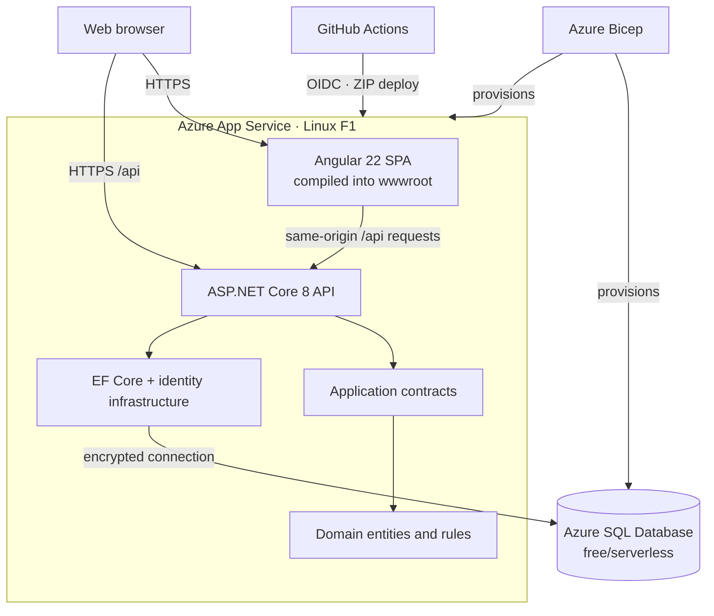
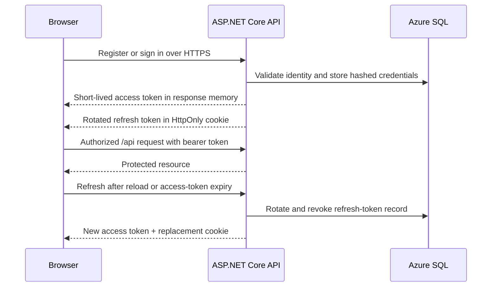

# CloudTrack

CloudTrack is a personal full-stack and Azure portfolio project built to keep ideas, tasks, and progress organized in one place. It demonstrates the complete identity lifecycle, role-based administration, project and task workflows, automated verification, App Service delivery, and infrastructure as code.

> Deployment status: the application is live on Azure App Service Free F1 with Azure SQL Free/Serverless. Local and cross-device E2E tests are also verified.

[Open the live CloudTrack demo](https://app-cloudtrack-dev-xe3xxsh.azurewebsites.net)

Live authentication routes:

- [Login](https://app-cloudtrack-dev-xe3xxsh.azurewebsites.net/auth/login)
- [Register](https://app-cloudtrack-dev-xe3xxsh.azurewebsites.net/auth/register)
- [Forgot password](https://app-cloudtrack-dev-xe3xxsh.azurewebsites.net/auth/forgot-password)

> Password recovery currently runs in clearly labelled portfolio demo mode. The API creates a 30-minute, single-use reset token and the UI exposes only a continue link because no email account or API key is stored in the demo. Responses include a non-persisted decoy token for unknown addresses so the response shape does not reveal whether an account exists. Replace this fallback with transactional email before using CloudTrack for real user data.

Angular is compiled into the ASP.NET Core `wwwroot` folder and served by the same Linux App Service as the API. No Static Web App, Docker runtime, or container registry is required for the Azure deployment.


## What it demonstrates

- Login, registration, logout, forgot password, reset password, and authenticated profile flows.
- Short-lived JWT access tokens with hashed, rotated refresh tokens in an HttpOnly cookie.
- `Admin`, `Manager`, and `Member` roles with protected user and role management.
- Project and task management with audit history, search, filters, paging, and optimistic concurrency.
- Responsive Angular Material UI verified against desktop Chromium and a Pixel 7 viewport.
- Layered ASP.NET Core backend running SQL Server everywhere: LocalDB for development and tests, Azure SQL in production.
- App Service ZIP delivery without Docker, GitHub Actions OIDC, secret scanning, health probes, and Bicep infrastructure.

## Architecture



The production deployment uses one App Service for both the Angular bundle and the API. Serving both from one origin avoids a separate Static Web App, container runtime, and production CORS dependency. Every environment uses the same database engine: SQL Server LocalDB for development and automated tests, and Azure SQL in production. Integration and E2E runs create a disposable database per run and drop it on teardown; CI starts an ephemeral SQL Server 2022 container for the same purpose.



The browser never receives database credentials or the JWT signing key. Non-secret Angular configuration is compiled with the frontend, while connection strings and signing settings are injected only into the backend through protected App Service application settings. The access token stays in memory; the refresh token is stored in a `Secure`, `HttpOnly`, same-site cookie.

### Frontend component structure

Page and layout components keep TypeScript logic, Angular markup, and component-scoped styling in co-located files:

```text
auth/
  auth-page.ts       Signals, reactive form state, validation, and service calls
  auth-page.html     Login, register, forgot-password, and reset-password markup
  auth-page.scss     Authentication page styles and responsive rules
```

The same `.ts` / `.html` / `.scss` convention is used by layouts, dashboard, profile, admin, projects, and shared feature pages. Angular's built-in style encapsulation remains enabled, while `src/styles.scss` is reserved for the Material theme, typography, reset rules, and genuinely global styles. The root `app.ts` intentionally keeps its single `<router-outlet />` inline because extracting a one-line template would add indirection without improving maintainability.

`angular.json` configures future standalone components to use external HTML and SCSS by default (`inlineTemplate: false`, `inlineStyle: false`, `style: scss`).

## Technology

| Area | Choice |
| --- | --- |
| Web | Angular 22, standalone components, Angular Material, signals |
| API | ASP.NET Core 8, controllers, Problem Details, rate limiting |
| Data | EF Core 8, SQL Server (LocalDB for dev and tests, Azure SQL in production) |
| Security | JWT bearer auth, password hashing, refresh-token rotation, RBAC |
| Quality | xUnit, ASP.NET integration tests, Vitest, Playwright, Prettier |
| Delivery | App Service ZIP, GitHub Actions OIDC, Gitleaks, Azure Bicep; optional Docker |
| Azure | Linux App Service Free F1, Azure SQL Database Free/Serverless |

## Run locally

Prerequisites: .NET SDK 8, Node.js 24, npm, and SQL Server. The default connection string targets SQL Server LocalDB (installed with the .NET SDK "Data storage and processing" workload or Visual Studio); to use a container or another instance instead, override `ConnectionStrings__DefaultConnection`. Docker is optional and can also supply SQL Server through Docker Compose.

### 1. Configure the API safely

Do not put a real key or password in `appsettings.json`. Store the local signing key outside Git with .NET user-secrets. EF Core creates the schema and seeds roles, permissions, and the admin account on first run:

```powershell
cd backend/src/CloudTrack.Api
dotnet user-secrets set "Jwt:SigningKey" "replace-with-at-least-32-random-characters"
dotnet run --urls http://localhost:5080
```

Swagger is available at `http://localhost:5080/swagger` in Development and health at `http://localhost:5080/health`.

### 2. Run the Angular app

```powershell
cd frontend
npm ci
npm start
```

Open `http://localhost:4200`. Registration is enabled, so no shared demo password is required.

### Docker Compose

Copy `.env.example` to `.env`, replace every placeholder locally, then run:

```powershell
docker compose up --build
```

The combined app is exposed at `http://localhost:8080`. `.env` is ignored and must never be committed.

## Verification

```powershell
dotnet test backend/CloudTrack.sln --configuration Release
cd frontend
npm test -- --watch=false
npm run build
npx prettier --check "src/**/*.{ts,html,scss}" "e2e/**/*.ts" angular.json
npm audit --omit=dev
npm run e2e
```

The backend integration tests and Playwright E2E run against SQL Server; both create and drop their own database, so a reachable SQL Server LocalDB (or a `CLOUDTRACK_TEST_SQLSERVER` / `CLOUDTRACK_E2E_SQLSERVER` override) is required.

CI repeats these checks, starts an ephemeral SQL Server 2022 container for the test and E2E jobs, and scans the full Git history for secrets. Azure delivery builds a ZIP package and is gated by the repository variable `AZURE_DEPLOY_ENABLED=true` plus an approved GitHub Environment.

## Security and configuration

- `appsettings.json` contains non-secret defaults and an empty signing key.
- Local secrets belong in .NET user-secrets or an ignored `.env` file.
- Azure secrets are protected App Service settings; they are never compiled into Angular or stored in GitHub.
- Forgot-password responses do not reveal whether an email exists.
- Demo reset links are single-use and expire after 30 minutes; production email delivery should set `Auth__ExposeDevelopmentResetToken=false`.
- Changing a password revokes all refresh tokens.
- The auth endpoints are rate-limited; API errors use consistent Problem Details.
- CI runs Gitleaks before delivery.

See [configuration guidance](docs/configuration.md) before committing or deploying.

## Repository map

```text
backend/
  src/CloudTrack.Domain/          Entities and domain state
  src/CloudTrack.Application/     Contracts and use-case abstractions
  src/CloudTrack.Infrastructure/  EF Core, authentication, services
  src/CloudTrack.Api/             HTTP boundary and composition root
  tests/                          Unit and integration tests
frontend/                         Angular app with co-located TS, HTML, and SCSS page files
infra/main.bicep                  Lowest-cost learning environment template
.github/workflows/                CI and gated Azure delivery
docs/                             Architecture, operations, and interview notes
```

## Documentation

- [Configuration and secret safety](docs/configuration.md)
- [Architecture decisions](docs/architecture-decisions.md)
- [Azure deployment runbook](docs/azure-deployment.md)
- [API surface](docs/api.md)
- [Interview notes](docs/interview-notes.md)
- [Docker workflow](docs/docker.md)

## Planned hardening

- Replace the portfolio reset-link fallback with a transactional email provider such as [Resend Free](https://resend.com/pricing), then disable token exposure.
- Move secrets to Key Vault if the operational trade-off is justified.
- Add private networking for Azure SQL and restore testing for backups.
- Add OpenTelemetry traces, explicit SLOs, and performance baselines.

The Git history is intentionally split into small conventional commits so reviewers can follow the project from foundation to delivery.
